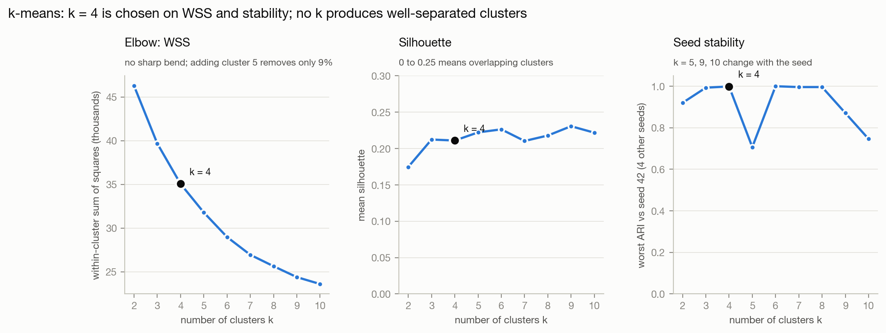
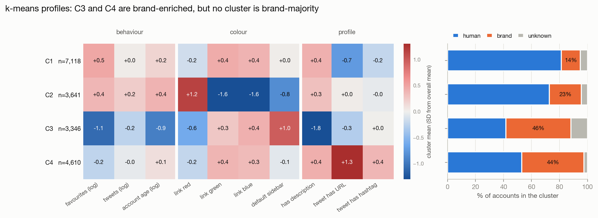
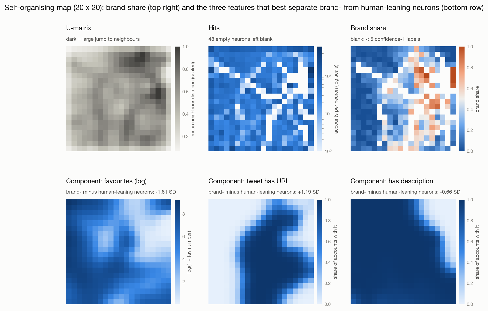
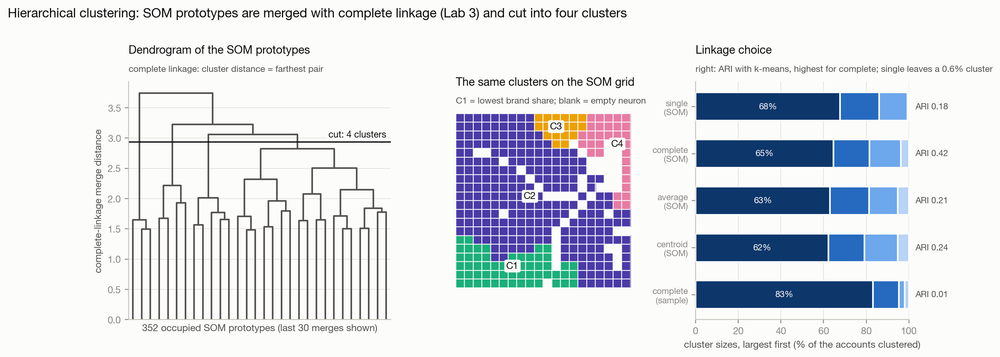
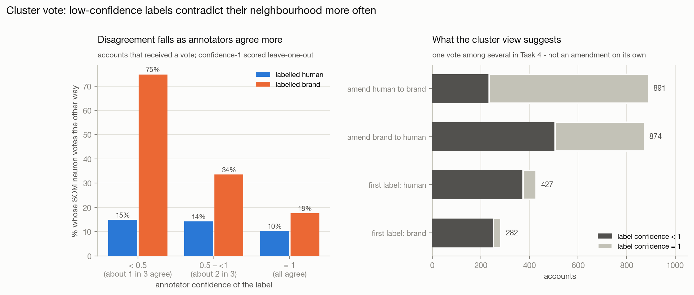

# Clustering

Clustering groups accounts without labels. An account labelled unlike most of
its neighbours may be mislabelled. Three methods were applied: k-means, a
self-organising map (SOM) and hierarchical clustering.

**Features.** The 18,715 accounts were clustered on ten structured features in
three views: behaviour (log favourites, tweets and account age), colour (the
red, green and blue channels of the link colour, and a default-sidebar flag)
and profile (description, URL and hashtag in the tweet). All features were
z-scored, so the 0–255 colour channels do not dominate the Euclidean distance.
Each feature was then weighted by 1/√(view size), so each view counts equally.
Labels were used only afterwards: the 13,121 unanimous labels (confidence 1;
26.2% brand) describe the clusters and form the vote.

## k-means

k-means was run with 10 random starts for k = 2 to 10 (Figure 1). Separation
was measured by the silhouette, (b − a) / max(a, b), where a is the mean
distance from an account to the rest of its cluster and b that to the nearest
other cluster. The adjusted Rand index (ARI) scores the agreement of two
partitions from 0 (random) to 1 (identical). Stability is the lowest ARI
across five seeds.

**Figure 1.** Choosing k: WSS, silhouette and seed stability.

The silhouette stays at 0.17–0.23, so the clusters overlap for every k. k = 4
was chosen: it matches k = 3 on silhouette, has a higher between-cluster share
of variance (0.38 vs 0.29), and is seed-stable (ARI 1.00), unlike k = 5
(0.71). A larger k gains at most 0.02 in silhouette but halves the smallest
cluster. No k reproduces the labels (ARI ≤ 0.08). Dropping the log transform
or the view weights changes the partition substantially (ARI 0.48, 0.44).

**Figure 2.** k-means centroids and label mix per cluster.

Two clusters are brand-enriched: C3 (young accounts, rarely a description,
default theme, few favourites) and C4 (URLs in tweets) are 43–46% brand among
unanimous labels, against 26% overall, but neither has a brand majority.

## SOM and hierarchical clustering

The SOM was trained on a 20 × 20 grid with PCA initialisation, a Gaussian
neighbourhood and 10 epochs. Of four grid sizes tested, this keeps the
topographic error low (0.013) and leaves a median of 38 accounts per neuron,
enough for the vote below.

**Figure 3.** The 20 × 20 SOM and the most separating features.

Feature means were compared between the 49 neurons that vote brand and the 120
that vote human. The largest differences are in favourites (−1.8 SD), tweets
with URLs (62% vs 5%), descriptions (63% vs 89%) and hashtags (30% vs 5%). The
default sidebar differs moderately (60% vs 38%). Tweet volume hardly differs
(+0.25 SD).

Hierarchical clustering was applied to the 352 occupied SOM prototypes, since
complete linkage on 3,000 raw accounts put 83% in one cluster. Each account
took its neuron's cluster. The tree was cut at k = 4, as for k-means. Of four
linkages (single, complete, average, centroid), complete agrees best with
k-means (ARI 0.42, against 0.18–0.24) and was chosen.

**Figure 4.** Dendrogram, SOM-grid clusters and linkage comparison.

Both methods find C3, which holds 91% of the most brand-rich hierarchical
cluster, but the hierarchy merges C4 into its largest cluster.

## Cluster vote

The vote for an account comes from the unanimous labels of the other accounts
in the same SOM neuron. The account's own label is excluded (leave-one-out),
and at least 10 labels are required. The vote is brand if the brand share of
these labels is at least twice the base rate (≥ 52.5%), human if at most half
(≤ 13.1%), and abstain otherwise. This lift-based rule agrees with 82% of
unanimous brand labels, whereas a majority vote reaches only 55%, as 74% of
labels are human. It votes on only 65% of accounts, against 97%.

**Table 1.** Share of voted accounts (n) whose neuron votes against their
label.

| Label | Confidence < 0.5 | 0.5 to < 1 | = 1 |
|---|---|---|---|
| brand | 75% (111) | 34% (1,259) | 18% (2,089) |
| human | 15% (222) | 14% (1,413) | 10% (6,384) |

**Figure 5.** Vote disagreement and suggested amendments.

Although the vote ignores the account's own confidence, disagreement is
highest for uncertain labels. A chi-square test of independence, which
compares observed with expected counts, gives p = 4 × 10⁻⁵⁶ for brand labels
and p = 2 × 10⁻⁵ for human labels. The vote suggests 891 human → brand and 874
brand → human amendments, but 1,025 of them contradict unanimous labels, so it
is only one view in Task 4.

## Summary

The clusters do not reproduce the human/brand labels, so labels cannot be
amended per cluster. Brand-leaning profiles still differ, mainly in
favourites, URLs, hashtags and descriptions. The neuron vote flags doubtful
labels, but the structure is weak and sensitive to preprocessing, and the vote
misses systematic annotator errors shared by neighbours.
