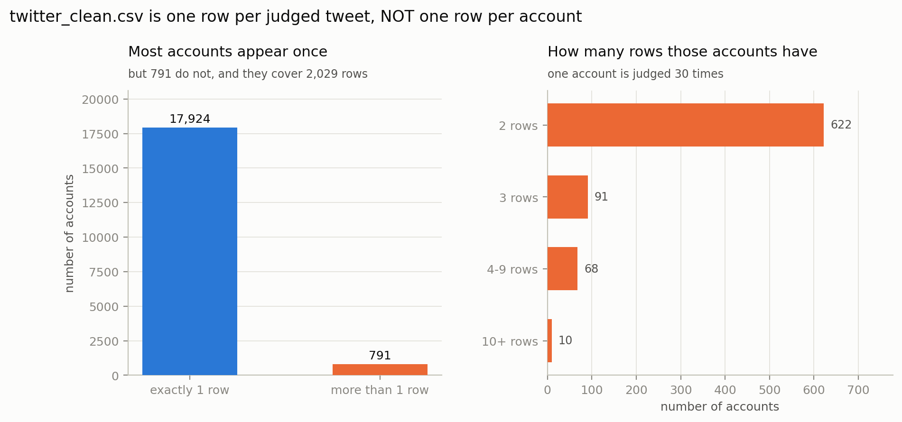
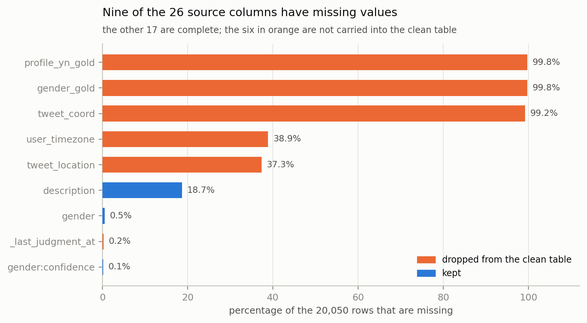
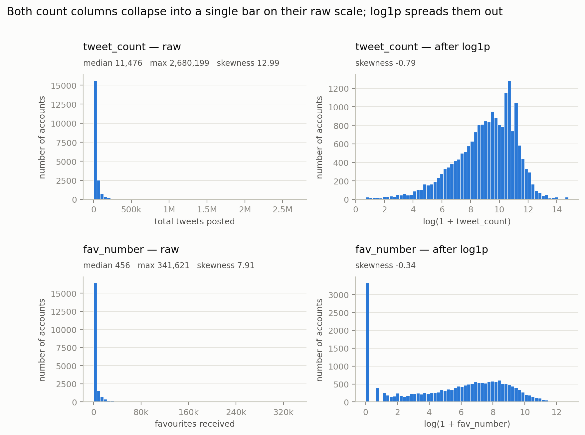

# Data Preparation

*Prepared by Tianyu He (9495204). Code: `code/prepare_data.py`,
`code/verify_data.py`, `code/make_figures.py`. Audit log:
`output/data_quality_report.txt`.*

This section covers Phase 2 (Data Preparation) of the Big Data Analytics
Lifecycle. It turns the raw CrowdFlower file into the tables the modelling,
visualisation and discussion tasks are built on, and states every decision
that was made about the data together with the evidence for it.

## 1. The source data

`twitter_user_data.csv` contains **20,050 rows and 26 columns**. Each row is
one crowdsourced judgement of one Twitter profile, recording the profile's
display name, description, one sampled tweet, two profile theme colours, three
behaviour counts, the account creation timestamp, and the annotators' gender
label with an agreement score.

The file is **not valid UTF-8**; the first invalid byte occurs at offset 927.
It is therefore read as `latin-1`, which never raises, but the emoji in the
original tweets were already corrupted before the file was distributed. This
is handled in §7.

## 2. Row filtering

97 rows have `profile_yn == "no"`, meaning the annotators could not read the
profile at all. It was verified that **all 97 of those rows also have a missing
`gender`**, so removing them loses no labelled data. There are no exact
duplicate rows. The working set is **19,953 rows**.

## 3. The file is not one row per account

This is the most consequential property of the data and it is not visible from
the row count.

An account key was constructed as `name` + `created` and validated: across all
791 repeated groups, `link_color`, `sidebar_color`, `tweet_location` and
`user_timezone` are **identical within every group** (variation count 0), which
establishes that the repeated rows are the same account rather than a name
collision.

On that key the 19,953 rows resolve to **18,715 distinct accounts**. 791
accounts appear on more than one row, covering **2,029 rows**; one account is
judged **30 times** (Figure 1). Each row is an *(account, sampled tweet)* pair
judged independently, which is why the same account can carry different labels
on different rows.

**Figure 1.** Rows per account. Most accounts are judged once, but 791 are not.

Two consequences follow:

1. **A random train/test split leaks.** The same account would land on both
   sides of the split, and every classification or regression score would be
   optimistic. Models must either split on `account_id` (for example with
   `GroupShuffleSplit`) or use the deduplicated account-level table.
2. **The disagreements are evidence, not noise.** 72 accounts are labelled
   *both* human and non-human across their rows, and 157 accounts disagree on
   gender at all. These are precisely the "profiles mistakenly recorded as
   human/non-human" the assignment asks about, so they are exported intact to
   `label_conflicts.csv` rather than being silently collapsed.

## 4. Constructing the target variable

The assignment asks about human versus non-human profiles, while the data
carries a four-valued `gender` column. The mapping used is:

| `gender` | `is_human` | Rows |
|---|---|---|
| `female`, `male` | 1 | 12,894 |
| `brand` | 0 | 5,942 |
| `unknown` | missing | 1,117 |

The 1,117 `unknown` rows are **kept, not deleted**. "Unknown" means the
annotators could not decide, which makes those profiles a plausible place for
mislabelling to concentrate; deleting them would remove that evidence before it
could be examined. A `label_known` flag is provided so that any model needing
a complete target can filter them out in one step.

`gender:confidence`, the annotators' agreement score, is carried forward as
`gender_confidence`. **6,027 of the 19,953 rows have a confidence below 1.0**,
so the labels are not uniformly reliable and the low-confidence rows are
natural candidates for the mislabelling analysis.

## 5. Column selection

Nine of the 26 source columns contain missing values; the remaining 17 are
complete (Figure 2).

**Figure 2.** Missing values by column, with the columns excluded from the
clean table shown in orange.

Columns were excluded for four distinct reasons, and the reason matters more
than the count:

| Excluded | Reason |
|---|---|
| `gender_gold`, `profile_yn_gold` | Present for only 50 of 20,050 rows (0.2%) — quality-control rows for the crowdsourcing job. |
| `tweet_coord` | Present for 159 rows (0.8%). |
| `user_timezone`, `tweet_location` | 38.9% and 37.3% missing, and free text with 156 and 7,863 distinct values. |
| `_golden`, `_unit_state`, `_trusted_judgments`, `_last_judgment_at` | Bookkeeping for the crowdsourcing job, not properties of the account. |
| `profile_yn`, `profile_yn:confidence` | Constant once the unreadable profiles are removed. |
| `tweet_created` | Five distinct values spanning 41 minutes on 26 October 2015 — no variation. |
| `tweet_id` | Two distinct values in the entire file. |
| `profileimage` | An image URL; using it would require downloading 20,050 images. |
| `created`, `link_color`, `sidebar_color` | Replaced by derived columns (§6, §8). |

`description` is 18.7% missing but is retained, because profile text is one of
the multiple "views" Task 4 asks about; a `has_description` flag marks the
empty ones rather than imputing them.

## 6. Repairing the colour columns

`link_color` and `sidebar_color` are hexadecimal colour codes, but only 92.5%
and 79.7% of their values are well-formed six-character hex. Three distinct
defects were found, each with a different cause and a different repair.

**Leading zeros stripped by a spreadsheet.** `009999` became `9999` (592 rows).
Values of one to five hex characters are left-padded with zeros.

**Hex codes read as scientific notation.** A spreadsheet interpreted a code
such as `221E07` as the number 221 × 10⁷ and stored it as `2.21E+09`. Recovery
requires writing the three significant digits back in front of the `E`, which
multiplies the mantissa by 100, so **the exponent must be reduced by 2**:
`2.21E+09 → 221E07`. This was verified numerically — `float(repaired) ==
float(raw)` for all 40 repaired values. Simply deleting the `.` and `+` gives
`221E09`, which denotes a number 100 times too large; that naive repair was
implemented first and rejected after verification.

**The literal value `"0"`.** 4,006 `sidebar_color` rows (20.1%) and 417
`link_color` rows hold the single character `0`. Padding gives `000000`
(black), but nothing in the data establishes whether these are a real black
theme or an export artefact, and `"0"` being the second most common sidebar
value — ahead of white — is suspicious. They are padded **and flagged**
`zero_suspect` so that colour-based models can be run with and without them.

Each colour therefore carries a `*_status` column with five possible values:

| Status | `link_color` | `sidebar_color` |
|---|---|---|
| `ok` | 18,452 | 15,898 |
| `padded` | 1,049 | 42 |
| `zero_suspect` | 417 | 4,006 |
| `sci_repaired` | 33 | 7 |
| `invalid` | 2 | 0 |

Repaired codes are decomposed into `*_r`, `*_g`, `*_b` (0–255) and a
perceived-brightness column `0.299R + 0.587G + 0.114B`. The two irrecoverable
`link_color` values are `9.00E+00`, whose exponent is below 2 and therefore has
no six-character reading, and `2-Feb-45`, which a spreadsheet converted into a
date.

## 7. Cleaning the text

Both text columns are kept twice: `*_raw` is the untouched source text, and
`*_clean` is the normalised version used for the length features and for any
bag-of-words or TF-IDF modelling.

Four defects are corrected in `*_clean`:

- **Corrupted emoji.** 3,734 tweets and 2,548 descriptions contain non-ASCII
  runs left over from the broken encoding, appearing as sequences such as
  `_Ù÷â`. Each run is glued to ASCII underscores on one or both sides, so the
  underscores are removed with it; removing only the non-ASCII bytes would
  leave 2,626 tweets and 971 descriptions carrying a stray `_` token.
- **Multiply-escaped HTML entities.** The source contains `J&amp;amp;J` and
  even `&amp;amp;amp;`, so a single unescape is insufficient; entities are
  unescaped repeatedly until the string stops changing.
- **URLs.** 7,341 tweets and 1,305 descriptions contain a URL. These are
  replaced with a single `URLTOKEN`, so that the *presence* of a link survives
  tokenisation while the specific address — unique per row and therefore
  useless to a model — does not. Malformed forms in the source
  (`http//www.example.org` with the colon lost, `bookhttp://...` glued to the
  preceding word) are matched as well.
- **Mentions and hashtags** become `MENTIONTOKEN` and `HASHTAGTOKEN`, with a
  negative lookbehind so that the `@site` part of an e-mail address is not
  counted as a mention.

Counts of URLs, mentions, hashtags and mojibake runs are retained as numeric
features, since their frequency may itself distinguish brand accounts from
individuals.

## 8. Derived numeric features

**Log transforms.** The behaviour counts are severely right-skewed:
`tweet_count` has a median of 11,476 against a maximum of 2,680,199 (skewness
12.99), and `fav_number` a median of 456 against a maximum of 341,621
(skewness 7.91). On the raw scale almost every account falls into the first
histogram bar (Figure 3). A `log1p` transform reduces the skewness to −0.79 and
−0.34 respectively. `log1p` rather than `log` because the columns contain
zeros.

**Figure 3.** The two count columns before and after the `log1p` transform.

Both the raw and the transformed columns are supplied. Distance-based methods
(k-means, KNN) require the transformed version, because on the raw scale the
squared Euclidean distance would be dominated almost entirely by
`tweet_count`. Tree-based methods are unaffected either way: a split tests one
feature against a threshold, and a strictly monotone transform preserves the
order of every pair of values, so every achievable split has a counterpart
after the transform.

**Account age and rates.** `created` is parsed for all 19,953 rows and spans
5 August 2006 to 26 October 2015. Subtracting it from the capture timestamp
gives `account_age_days` (range 0 to 3,368). Dividing the counts by it gives
`tweets_per_day` and `favs_per_day`, which are comparable across accounts in a
way the raw totals are not — 1,693 tweets means something different over ten
years than over one month.

**`retweet_count`.** This column is 0 for **96.9%** of rows. It is retained for
completeness, but a binary `has_retweets` is supplied and should be preferred,
because a near-constant column contributes almost nothing to a distance or a
split while still consuming a dimension.

## 9. Outputs

| File | Rows × Columns | Contents |
|---|---|---|
| `twitter_clean.csv` | 19,953 × 55 | One row per judged tweet. Use with `account_id` grouping. |
| `twitter_clean_accounts.csv` | 18,715 × 55 | One row per account, already deduplicated. |
| `label_conflicts.csv` | 493 rows, 157 accounts | Every row of every account whose labels disagree. |
| `column_guide.csv` | 55 entries | Type, missing count, distinct count and meaning of every output column. |
| `data_quality_report.txt` | — | Audit trail of the run that produced the above. |

The account-level table is built with explicit aggregation rules rather than a
default. Counts are taken as the **maximum** across the account's rows, because
the snapshots were captured at slightly different moments and `tweet_count`
differs within 205 of the 791 repeated accounts; the label and text are taken
from **one whole row**, the one with the highest `gender_confidence`. Using
`groupby().first()` here would be incorrect: pandas returns the first non-null
value *per column*, so an account whose highest-confidence row is `unknown`
would be assigned an `is_human` value taken from a different row. That defect
was present in an earlier version and produced 26 self-contradictory account
records before it was detected.

## 10. Verification

`verify_data.py` shares no code with the pipeline. It re-reads the raw CSV and
recomputes every claim independently, so a defect in a pipeline helper cannot
hide behind that same helper. It performs **40 checks** across row counts and
keys, label counts, colour repair, text cleaning, derived features, account
aggregation and documentation completeness, and exits non-zero if any fails.

The checks test values, not only shapes. The scientific-notation check, for
instance, requires `float(repaired_hex) == float(raw_value)`; an earlier
version only tested that the repair was valid hexadecimal, which allowed a
numerically wrong repair to pass undetected.

Current status: **40/40 checks passed.**

## 11. Limitations

1. **Ambiguous colour repairs.** 8 of the 40 scientific-notation repairs have a
   mantissa ending in zero, so a reading with leading zeros (`020E68`,
   `002E69`) is numerically identical. The no-leading-zero reading was chosen.
2. **`"0"` colours cannot be resolved.** 4,006 sidebar and 417 link values are
   stored as `000000` and flagged; whether they are real black is undecidable
   from the data. Colour-based results should be reported both with and
   without them.
3. **Non-ASCII removal is indiscriminate.** `*_clean` drops every non-ASCII
   character, which includes legitimate accented text and symbols such as `£`,
   not only corrupted emoji. This is acceptable for English bag-of-words and
   TF-IDF models but would not be for multilingual analysis.
4. **The account-level label is a choice.** For accounts with several rows the
   account table keeps the highest-confidence row. For the 157 conflicting
   accounts this is a judgement rather than a fact, which is why every original
   row is preserved in `label_conflicts.csv`.
5. **`likes`, sales and engagement over time are absent.** The file is a single
   snapshot taken within a 41-minute window, so no temporal behaviour can be
   modelled.

## 12. Guidance for the modelling tasks

- **Target:** `is_human`. Filter on `label_known == 1` for a complete target.
- **Never use as features:** `name`, `gender`, `gender_confidence`,
  `label_known`, `label_conflict_human_brand`, `label_conflict_gender`. Each is
  the label or is derived from it; using any of them would leak the answer.
- **Splitting:** group on `account_id`, or use `twitter_clean_accounts.csv`.
- **Distance-based models:** use the `log_` columns.
- **Text models:** use `*_clean`; `*_raw` is provided for inspection only.
- **Colour models:** check `*_status` and consider excluding `zero_suspect`.
